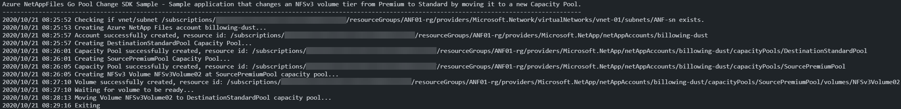

# Azure NetAppFiles Pool Change SDK Sample for Go

This sample project demonstrates how to dynamically change a volume's service level by moving from one capacity pool to another with a different performance tier using Azure Go SDK with Microsoft.NetApp resource provider. It works independently of the protocol type used. 

In this sample application, we perform the following operations:

* Creation
  * NetApp account
    * Source capacity pool
      * NFSv3 volume
    * Destination capacity pool
* Update
  * Volume gets moved from source to destination capacity pool
* Clean up created resources (not enabled by default)

If you don't already have a Microsoft Azure subscription, you can get a FREE trial account [here](http://go.microsoft.com/fwlink/?LinkId=330212).

## Prerequisites

1. Go installed \(if not installed yet, follow the [official instructions](https://golang.org/dl/)\)
1. Azure Subscription.
1. Subscription needs to be enabled for Azure NetApp Files. For more information, see [this](https://docs.microsoft.com/azure/azure-netapp-files/azure-netapp-files-register#waitlist) document.
1. Request preview access for Azure NetApp Files Pool Change. For more information, see [this](https://docs.microsoft.com/en-us/azure/azure-netapp-files/dynamic-change-volume-service-level#register-the-feature) document.  (This step is required only during the preview stage of the Pool Change feature.) 
1. Resource Group created.
1. Virtual Network with a delegated subnet to Microsoft.Netapp/volumes resource. For more information, see [Guidelines for Azure NetApp Files network planning](https://docs.microsoft.com/en-us/azure/azure-netapp-files/azure-netapp-files-network-topologies).
1. Adjust variable contents within the `var()` block at `example.go` file to match your environment.
1. For this sample Go console application work, authentication is needed.  The chosen method for this sample is service principals:
    * Within an [Azure Cloud Shell](https://docs.microsoft.com/en-us/azure/cloud-shell/quickstart) session, make sure you're logged in from the subscription where you want to be associated with the service principal by default. 

      ```bash
      az account show
      ```

      If this is not the correct subscription, use: 

      ```bash
      az account set -s <subscription name or id>  
      ```

    * Create a service principal using Azure CLI: 

      ```bash
      az ad sp create-for-rbac --sdk-auth
      ```

      >Note: This command will automatically assign RBAC contributor role to the service principal at subscription level. You can narrow down the scope to the specific resource group where your tests will create the resources.

    * Copy the output content, paste it in a file called azureauth.json, and secure it with file system permissions. (Make sure it is not inside of any repo.)
    * Set an environment variable pointing to the file path you just created. The following example uses Powershell and bash:

      Powershell

      ```powershell
      [Environment]::SetEnvironmentVariable("AZURE_AUTH_LOCATION", "C:\sdksample\azureauth.json", "User")
      ```

      Bash

      ```bash
      export AZURE_AUTH_LOCATION=/sdksamples/azureauth.json
      ```

    >Note: for other Azure Active Directory authentication methods for Go, please refer to [Authentication methods in the Azure SDK for Go](https://docs.microsoft.com/en-us/azure/go/azure-sdk-go-authorization).

## What does example.go do

This sample project demonstrates how to change a volume's service level from Premium to Standard by moving it to another capacity pool. Similar to other examples, the authentication method is based on a service principal. This project will create one NetApp account and two capacity pools (source as Premium and destination as Standard service levels). A single volume will be created using the capacity pool with the Premium service level, and later it will be moved to demonstrate the service level change.

In addition, we use non-sensitive information from the *file-based authentication* file where, in the initial stages, we get the subscription ID. This information is used for the test we perform to check if the subnet provided exists before creating any Azure NetApp Files resources, failing execution if they're missing.

Authentication is made on each operation where we obtain an authorizer to pass to each client we instantiate (in Azure Go SDK for Azure NetApp Files, each resource has its own client). For more information about the authentication process used, see the [Use file-based authentication](https://docs.microsoft.com/en-us/azure/go/azure-sdk-go-authorization#use-file-based-authentication) section of the [Authentication methods in the Azure SDK for Go](https://docs.microsoft.com/en-us/azure/go/azure-sdk-go-authorization) document.

Lastly, the clean-up process takes place. (This process is not enabled by default. You need to change the variable `shouldCleanUp` to `true` in the `example.go` file `var()` section if you want to perform clean-up.)  The process deletes all resources in the reverse order following the hierarchy; otherwise, resources that have nested resources cannot be removed. If there is an error during the application execution, the clean-up may not take place, and you will need to manually perform this task later.
The clean-up process uses a function called `WaitForNoANFResource`, while other parts of the code uses `WaitForANFResource`.  This behavior is required as a workaround for a current ARM behavior that reports that the object was deleted, although in fact its deletion is still in progress.  (Similarly, ARM states that the volume is fully created, although the process is still finishing up.)  Also, we will see some functions called `GetANF<resource type>`; these functions were created in this sample to get the name of the resource without its hierarchy represented in the `<resource type>.name` property, which cannot be used directly in other methods of Azure NetApp Files client like `get`.

>Note: See [Resource limits for Azure NetApp Files](https://docs.microsoft.com/en-us/azure/azure-netapp-files/azure-netapp-files-resource-limits) about Azure NetApp Files resource limits.

## Contents

| File/folder                 | Description                                                                                                      |
|-----------------------------|------------------------------------------------------------------------------------------------------------------|
| `.github\CODE_OF_CONDUCT.md`        | Microsoft's Open Source Code of Conduct.                                                                         |
| `.github\ISSUE_TEMPLATE.md`        | GitHub's issue report that describes necessary info while opening a new issue                                                                         |
| `.github\PULL_REQUEST_TEMPLATE.md`        | GitHub's pull request template.                                                                         |
| `media\`                       | Folder that contains screenshots.                                                                                              |
| `netappfiles-go-pool-change-sdk-sample\`                       | Sample source code folder.                                                                                              |
| `netappfiles-go-pool-change-sdk-sample\example.go`            | Sample main file.                                                                                                |
| `netappfiles-go-pool-change-sdk-sample\go.mod`            |The go.mod file defines the module’s module path, which is also the import path used for the root directory, and its dependency requirements, which are the other modules needed for a successful build.|
| `netappfiles-go-pool-change-sdk-sample\go.sum`            | The go.sum file contains hashes for each of the modules and it's versions used in this sample|
| `netappfiles-go-pool-change-sdk-sample\internal\`       | Folder that contains all internal packages dedicated to this sample.                |
| `netappfiles-go-pool-change-sdk-sample\internal\iam\iam.go` | Package that allows us to get the `authorizer` object from Azure Active Directory by using the `NewAuthorizerFromFile` function. |
| `netappfiles-go-pool-change-sdk-sample\internal\models\models.go`       | Provides models for this sample, e.g. `AzureAuthInfo` models the authorization file.                   |
| `netappfiles-go-pool-change-sdk-sample\internal\sdkutils\sdkutils.go`       | Contains all functions that directly uses the SDK and some helper functions.                   |
| `netappfiles-go-pool-change-sdk-sample\internal\uri\uri.go`       | Provides various functions to parse resource IDs and get information or perform validations.                   |
| `netappfiles-go-pool-change-sdk-sample\internal\utils\utils.go`       | Provides generic functions.                   |
| `.gitignore`                | Define what to ignore at commit time.                                                                            |
| `CHANGELOG.md`              | List of changes to the sample.                                                                                   |
| `CONTRIBUTING.md`           | Guidelines for contributing to the sample.                                                                       |
| `README.md`                 | This README file.                                                                                                |
| `LICENSE`                   | The license for the sample.                                                                                      |

## How to run

1. Go to your GOPATH folder and create the following path: 
    ```powershell
    # PowerShell example
    cd $env:GOPATH/src
    mkdir ./github.com/Azure-Samples
    ```

    ```bash
    # Bash example
    cd $GOPATH/src
    mkdir -p ./github.com/Azure-Samples
    ```
2. Clone the sample locally:
    ```bash
    cd github.com/Azure-Samples
    git clone https://github.com/Azure-Samples/netappfiles-go-pool-change-sdk-sample.git
    ```
3. Change folder to **netappfiles-go-pool-change-sdk-sample/netappfiles-go-pool-change-sdk-sample**: 
    ```bash
    cd netappfiles-go-pool-change-sdk-sample/netappfiles-go-pool-change-sdk-sample
    ```
4. Make sure you have the `azureauth.json` and its environment variable with the path to it defined (as previously described at [prerequisites](#Prerequisites)). 
6. Edit file **example.go** `var()` block and change the variables contents as appropriate (names are self-explanatory).
7. Run the sample
    ```bash
    go run .
    ```

Sample output


## References

* [Dynamically change the service level of a volume](https://docs.microsoft.com/en-us/azure/azure-netapp-files/dynamic-change-volume-service-level#register-the-feature)
* [Service levels for Azure NetApp Files](https://docs.microsoft.com/en-us/azure/azure-netapp-files/azure-netapp-files-service-levels)
* [Authentication methods in the Azure SDK for Go](https://docs.microsoft.com/en-us/azure/go/azure-sdk-go-authorization)
* [Azure SDK for Go Samples](https://github.com/Azure-Samples/azure-sdk-for-go-samples) - contains other resource types samples
* [Resource limits for Azure NetApp Files](https://docs.microsoft.com/en-us/azure/azure-netapp-files/azure-netapp-files-resource-limits)
* [Azure Cloud Shell](https://docs.microsoft.com/en-us/azure/cloud-shell/quickstart)
* [Azure NetApp Files documentation](https://docs.microsoft.com/en-us/azure/azure-netapp-files/)
* [Azure SDK for Go](https://github.com/Azure/azure-sdk-for-go) 
